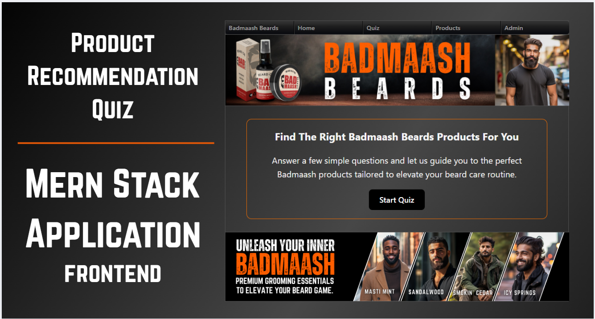
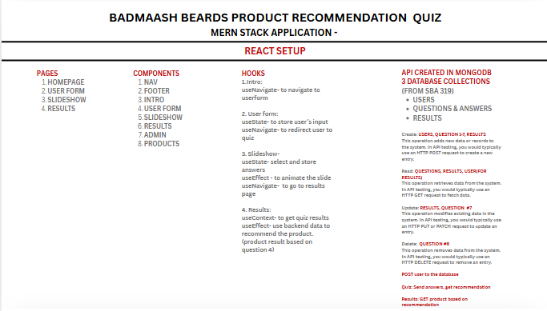
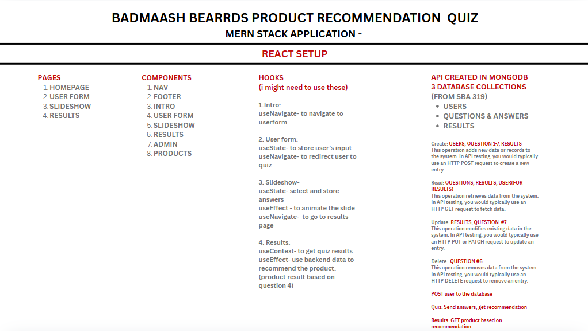
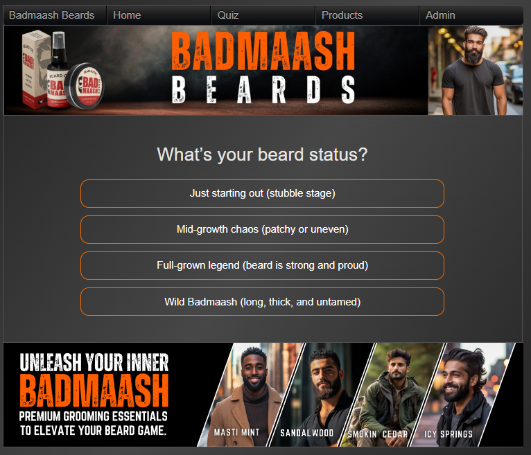
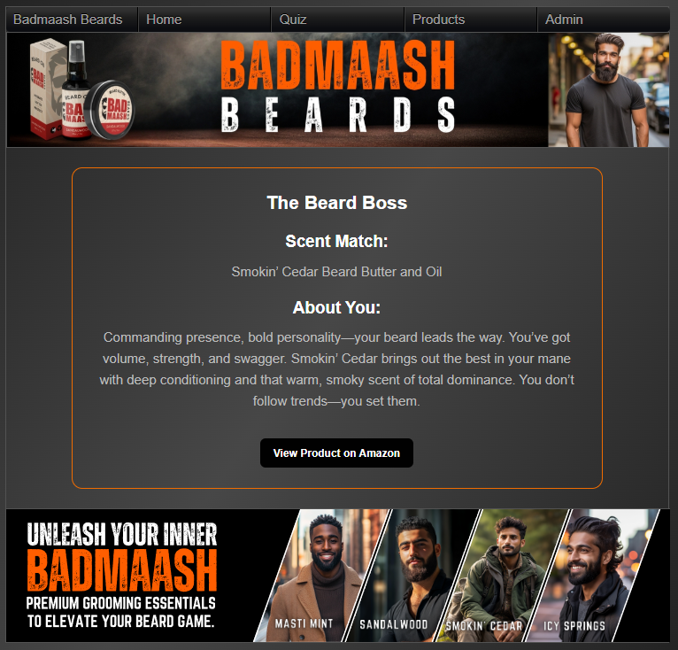

  

## Product Recommendation Quiz Application for Badmaash Beards
# Capstone Project | Frontend (MERN Stack)


Welcome to the Badmaash Beards Product Recommendation Quiz App — a simple, interactive quiz that helps users find the perfect Badmaash Beards products tailored to their unique style and grooming needs.

Badmaash Beards is a local small business I've been proud to build from the ground up. From designing the logo and packaging to managing Amazon listings with SEO optimization, A+ content creation, social media marketing, and website design — I've been involved in every step of the brand's journey.

For my capstone project, I wanted to elevate this experience by developing a quiz app that guides customers to the right products with ease and fun. This project has been an exciting opportunity for me to combine my creative and technical skills, pushing myself further into full stack development.

The Badmaash Beards Product Recommendation Quiz App is an interactive quiz that helps users find the right beard products based on their preferences and beard care needs.

## Main Application Flow:

# Quiz:
- The user opens the app and navigates to the quiz.
- The user answers multiple-choice questions about their beard type, skin type, personality, and grooming needs.
- The app dynamically fetches quiz questions from the MongoDB database.
- After completing the quiz, the user's answers are evaluated to determine the best product match.
- The result is retrieved from the MongoDB database and displayed.

# Result Structure:
- Product Title
- Scent Match
- Description
- Direct Amazon Link to view/purchase the recommended product.

# Admin Panel:
- dmins can update usernames and delete users from the database.
- Access is protected by an Admin Login page.

# Products Page:
- A dedicated page showcasing all Badmaash Beards products.
- Each product is linked directly to the Amazon Storefront for easy purchase.


---

##  Features
-  Dynamic product quiz with personalized results
-  React frontend with smooth navigation
-  Data fetched from MongoDB (Questions & Results)
-  Users create profile and data saved in MongoDB
-  Admin management: Update & Delete profiles
-  Direct Amazon product links on quiz results
-  Modern UI with styled-components / CSS modules

---

## Tech Stack
- **Frontend**: React.js, React Router, Axios, Vite
- **Backend**: Node.js, Express.js, Mongoose, MongoDB 
- **Styling**: Custom CSS, Flexbox, Responsive Design
- **Version Control**: Git & GitHub

---
## Future Plans
The Badmaash Beards Product Recommendation Quiz is just the beginning. Here’s how I plan to enhance and expand its impact:

# Integration with Website & Platforms
Embed the quiz directly on the official Badmaash Beards website for seamless user experience.
Share interactive quiz links across social media platforms (Instagram, Facebook, TikTok) to drive traffic and engage new customers.
Explore linking the quiz experience on Amazon storefronts to guide potential buyers in real-time.

# Enhanced Product & Routine Recommendations
Expand quiz logic to not only suggest products but also provide personalized beard care routines based on user responses.
Recommend product bundles (butters, oils, brushes, kits) for complete grooming solutions.
Include educational content for beard care tips, usage instructions, and maintenance routines.

# More Dynamic & Interactive UX
Add visual progress indicators and dynamic animations for a more engaging quiz experience.
Introduce user profiles to save quiz results and product preferences.
Enable sharing quiz results on social media with custom graphics.

# Analytics & Feedback
Track quiz engagement and user responses with basic analytics.
Gather customer feedback for continuous improvement.

## Wire Frames






## Screenshots




## Deployed Site:
https://syed-ferheen-frontendproductquizapp.onrender.com/

## Setup Instructions

### 1. Clone the Repository
```bash
git clone https://github.com/ferheen4535/Syed_Ferheen_FrontendProductQuizApp_Capstone
cd badmaash-beards-quiz
Product Recommendation Quiz

## Backend
git clone https://github.com/ferheen4535/Syed_Ferheen_BackendProductQuizApp_Capstone


## Resources

Get/fetch data from MongoDB and display them in Reactjs application
https://www.youtube.com/watch?v=Mfp94RjugWQ

Fetch Data from Mongo DB and Show it to React using Node JS
https://www.youtube.com/watch?v=51JCCLjImnA

Get/fetch data from mongo db and show it in React JS | Fetch data from mongo | CRUD Mongo Db
https://www.youtube.com/watch?v=BpR5dGRxeA8

Responsive React Cards | Mobile First Shopping Cards
https://www.youtube.com/watch?v=3_gakM-y7hE

Shopping Cart In React Js For Newbies
https://www.youtube.com/watch?v=NJ1inoC1L1k

How To Create An Advanced Shopping Cart With React and TypeScript
https://www.youtube.com/watch?v=lATafp15HWA

https://stackoverflow.com/questions/70293669/responsive-card-grid-in-react